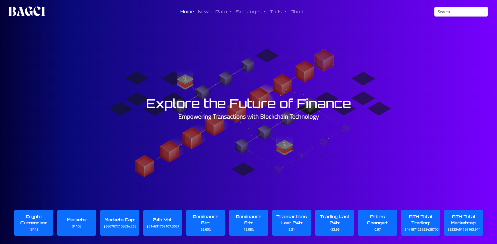

# Crypto Data API 



Welcome to the Crypto Data API project! This API allows you to fetch real-time cryptocurrency data.

## Features

- Fetch current price of various cryptocurrencies
- Historical data for cryptocurrencies
- Market capitalization and volume data

## Installation

1. Clone the repository:
    ```bash
    git clone https://github.com/mustafa-bagci/CryptoDataAPI.git
    ```
2. Navigate to the project directory:
    ```bash
    cd crypto-currency-api
    ```
3. Install dependencies:
    ```bash
    npm install
    ```

## Usage

1. Start the server:
    ```bash
    npm start
    ```
2. Access the API at `http://localhost:3000`

## Endpoints

- `/api/v1/price/:currency` - Get the current price of a specific cryptocurrency
- `/api/v1/historical/:currency` - Get historical data for a specific cryptocurrency
- `/api/v1/market-cap/:currency` - Get market capitalization data for a specific cryptocurrency

## Contributing

Contributions are welcome! Please fork the repository and submit a pull request.
